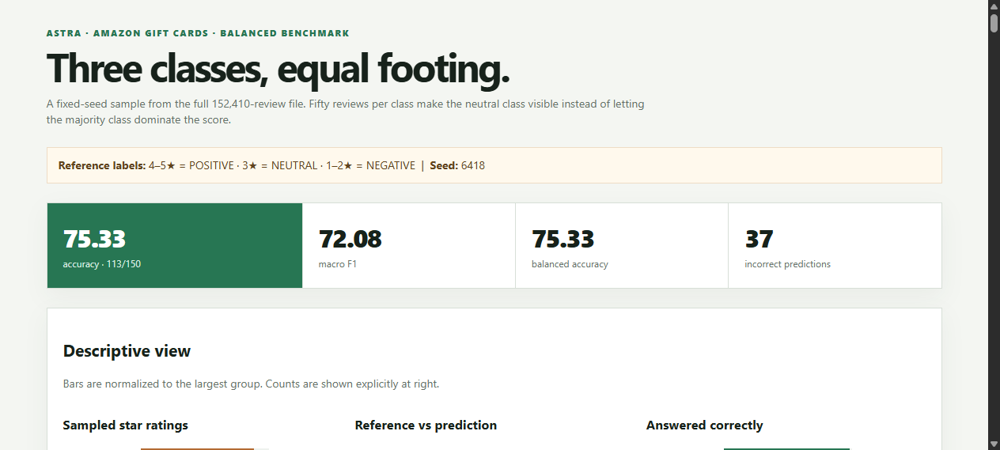

# Amazon Gift Cards: Sentiment and Emotion Classification

## Final deliverables review

This project classifies Amazon Gift Cards reviews by sentiment and primary emotion. The implementation uses a reusable prompt, blinded LLM predictions, a post-hoc rating-derived reference target, an NRC word-list comparison, and a self-contained offline dashboard.

## Data source

The reviews come from the **Amazon Reviews '23** dataset collected by the McAuley Lab at UC San Diego. Dataset overview, scale, categories, and field definitions:

- [Amazon Reviews '23 dataset page](https://amazon-reviews-2023.github.io/)
- [Gift Cards review file](https://mcauleylab.ucsd.edu/public_datasets/data/amazon_2023/raw/review_categories/Gift_Cards.jsonl.gz)
- [Amazon Reviews '23 paper](https://arxiv.org/abs/2403.03952)

The Gift Cards source is gzipped JSON Lines. The project validated all **152,410** source reviews and used the fields `rating`, `title`, `text`, `verified_purchase`, `helpful_vote`, `timestamp`, `images`, `asin`, `parent_asin`, and `user_id`. Ratings are integral float values from 1.0 through 5.0.

## Deliverables

| Deliverable | File |
|---|---|
| Reusable sentiment and emotion prompt | [`sentiment_prompt.py`](sentiment_prompt.py) |
| Balanced-run scoring script | [`score_balanced_3class.py`](score_balanced_3class.py) |
| NRC word-list loader and emotion scorer | [`emotion_lexicon.py`](emotion_lexicon.py) |
| Word-list execution script | [`run_emotion_lexicon.py`](run_emotion_lexicon.py) |
| Dashboard generator | [`build_balanced_dashboard.py`](build_balanced_dashboard.py) |
| One balanced run's raw LLM output | [`llm_batch_1.json`](evaluation/balanced-3class-150/llm_batch_1.json) |
| Final dashboard | [`dashboard.html`](evaluation/balanced-3class-150/dashboard.html) |
| Saved scoring output | [`metrics.json`](evaluation/balanced-3class-150/metrics.json) |
| Review-level evidence | [`scored_reviews.json`](evaluation/balanced-3class-150/scored_reviews.json) |
| Browser capture of final interface | [`dashboard-task11.png`](evaluation/balanced-3class-150/dashboard-task11.png) |



The dashboard is a standalone HTML file: it requires no server, external library, network request, or API at runtime.

## Target definition and evaluation design

The balanced benchmark uses a fixed random seed of **6418** and samples **50 reviews per class** from the full source file:

- Ratings 4–5 → `POSITIVE`
- Rating 3 → `NEUTRAL`
- Ratings 1–2 → `NEGATIVE`

The LLM input contains only an ID, title, and review text. Ratings, rating-derived labels, reference answers, and word-list results are withheld until after predictions are locked. The rating rule is an evaluation proxy, not independent gold sentiment truth.

## 1. Why did the lopsided run look accurate?

The historical binary run evaluated the first **100** reviews in file order. Its saved reference distribution was **93 POSITIVE** and **7 NEGATIVE**. Astra got **98/100** correct (**98%**), but an always-POSITIVE classifier would already score **93/100** (**93%**). The binary confusion matrix contained **92** positive reviews correctly called positive, **6** negative reviews correctly called negative, one positive review called negative, and one negative review called positive.

Therefore, the 98% accuracy was dominated by the majority class. It did not provide much evidence about the rarer negative cases and contained only **2** three-star reviews in its rating breakdown.

Equal sampling changed the question. The balanced run contains **50 POSITIVE, 50 NEUTRAL, and 50 NEGATIVE** reviews, so each class contributes equally to accuracy and macro metrics. Accuracy fell to **75.33% (113/150)**, but this is a more informative estimate of class behavior because the neutral and negative classes can no longer be hidden by the majority class.

## 2. Where do the mistakes go?

The balanced-run confusion matrix below is copied from `evaluation/balanced-3class-150/metrics.json` and is also visible in the final dashboard. Rows are the rating-derived reference class; columns are Astra's prediction.

| Reference ↓ / Prediction → | POSITIVE | NEUTRAL | NEGATIVE |
|---|---:|---:|---:|
| POSITIVE | 49 | 1 | 0 |
| NEUTRAL | 8 | 17 | 25 |
| NEGATIVE | 2 | 1 | 47 |

The dominant failure direction is **NEUTRAL → NEGATIVE: 25 reviews**. Neutral reviews are also called positive **8 times**. Thus only **17 of 50** neutral reviews are retained as neutral (**34%** recall).

Negative reviews are mostly recognized: **47 of 50** are called negative (**94%** recall). Negative reviews are called positive **2 times** and neutral **1 time**. Positive reviews are also recognized strongly: **49 of 50** are called positive (**98%** recall).

The model predicted **59 POSITIVE**, **19 NEUTRAL**, and **72 NEGATIVE** reviews, compared with the reference count of 50 in each class. The class-level correct rates are visible in the dashboard as **49/50 (98%)** for positive, **17/50 (34%)** for neutral, and **47/50 (94%)** for negative.

Overall balanced-run metrics are **75.33% accuracy**, **72.08% macro F1**, and **75.33% balanced accuracy**. The three-star subset contains exactly **50** reviews: Astra predicted **17 NEUTRAL**, **25 NEGATIVE**, and **8 POSITIVE**. Three-star reviews have their own class in the pipeline, but the model collapses most of them into polarity.

## 3. How do the LLM and word-list emotions differ?

Each LLM output includes one primary emotion from the eight NRC categories: anger, anticipation, disgust, fear, joy, sadness, surprise, or trust. Independently, the NRC word-list scorer counts emotion-bearing words and chooses the highest-scoring emotion using deterministic tie ordering. The LLM interprets context; the word list counts lexical associations without understanding context, negation, sarcasm, or the relationship between a word and the review's overall meaning.

In the balanced run, the two methods had an emotion match on **13 of 121** reviews where the NRC method had at least one matched word (**10.74%** agreement). Across all **150** reviews, including **29** with no NRC match, agreement was **8.67%**. The LLM and NRC distributions were visibly different:

| Emotion | LLM | NRC word list |
|---|---:|---:|
| anger | 40 | 12 |
| anticipation | 2 | 77 |
| disgust | 6 | 1 |
| fear | 3 | 3 |
| joy | 38 | 12 |
| sadness | 26 | 3 |
| surprise | 7 | 1 |
| trust | 28 | 12 |
| no match | — | 29 |

The largest divergence is **anticipation**: the word list selected it for **77** reviews, while the LLM selected it for **2**. Repeated words such as “gift,” “good,” and “time” can accumulate anticipation associations even when the review's context expresses anger, disappointment, or sadness. Conversely, the LLM can use the whole review to identify an emotional interpretation that is not represented by the highest lexical count. The **29** no-match cases also show a limitation of word-list scoring: short or unusual reviews may contain no recognized NRC emotion words.

## 4. Bugs, issues, and workarounds

- **Class imbalance:** Reading the first rows produced a 93-to-7 binary split. The workaround was to scan all 152,410 reviews and sample 50 per class with seed 6418.
- **Rating leakage risk:** Ratings and derived labels were kept out of every blind LLM input. They were joined only after predictions were locked.
- **Inline dashboard script failure:** Review text can contain HTML-like sequences. The generator escapes `</` in embedded JSON so review content cannot terminate the dashboard script.
- **Stale dashboard DOM update:** An earlier dashboard script still referenced a removed `#baseline` element. That exception prevented filter handlers from being attached. Removing the stale update restored the live table and filters.
- **Rating filter mismatch:** Dropdown values such as `3` initially failed to match stored values such as `3.0`. The filter now converts ratings to numbers before comparison.
- **Bar overflow:** The reference-versus-prediction chart initially normalized prediction bars only against the reference maximum, producing widths above 100%. The chart now normalizes against the maximum of both distributions.
- **Small chart elements:** Correct-rate and star-rating bars use explicit minimum widths while displaying exact counts beside the bars, so small groups remain visible and interpretable.
- **Emotion-method limitations:** NRC scoring is intentionally independent from the LLM, but its lexical counts can miss context and return no match. The report preserves both methods instead of treating one as a replacement for the other.

## Reproduction and verification

Run the tests:

```bash
python -m unittest discover -s tests -v
```

The final verification completed with **8 tests passing**. The dashboard was also checked in Chromium against the saved output: it rendered **150** initial rows, **37** error rows under the errors filter, and **50** rows under the three-star filter. Browser checks confirmed the visible star counts, class distributions, correct rates, and bounded chart widths listed above.

## Submission

Repository: [github.com/jamc9424-hash/assignment1](https://github.com/jamc9424-hash/assignment1)

The repository contains this report, the project code, the balanced raw output, the saved scoring artifacts, and the final dashboard.
